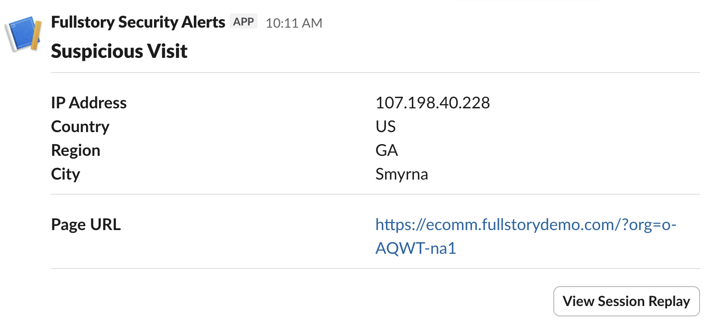

# Slack Block Kit

Creating more feature-rich messages is possible with Slack [Block Kit](https://docs.slack.dev/block-kit/). Use the final [JSON Mapping](#final-json-mapping) found at the end or follow the steps to create your own Block Kit message.



To build the above, perform the following.

1. Start with a [template](https://app.slack.com/block-kit-builder/T02FE3LFK#%7B%22blocks%22:%5B%7B%22type%22:%22header%22,%22text%22:%7B%22type%22:%22plain_text%22,%22text%22:%22%5B'var',%20'stream.name'%5D%22%7D%7D,%7B%22type%22:%22divider%22%7D,%7B%22type%22:%22section%22,%22fields%22:%5B%7B%22type%22:%22mrkdwn%22,%22text%22:%22*IP%20Address*%22%7D,%7B%22type%22:%22mrkdwn%22,%22text%22:%22%5B'var',%20'event.0.ip_address'%5D%22%7D,%7B%22type%22:%22mrkdwn%22,%22text%22:%22*Country*%22%7D,%7B%22type%22:%22mrkdwn%22,%22text%22:%22%5B'var',%20'event.0.country'%5D%22%7D,%7B%22type%22:%22mrkdwn%22,%22text%22:%22*Region*%22%7D,%7B%22type%22:%22mrkdwn%22,%22text%22:%22%5B'var',%20'event.0.region'%5D%22%7D,%7B%22type%22:%22mrkdwn%22,%22text%22:%22*City*%22%7D,%7B%22type%22:%22mrkdwn%22,%22text%22:%22%5B'var',%20'event.0.city'%5D%22%7D%5D%7D,%7B%22type%22:%22divider%22%7D,%7B%22type%22:%22section%22,%22fields%22:%5B%7B%22type%22:%22mrkdwn%22,%22text%22:%22*Page%20Name*%22%7D,%7B%22type%22:%22mrkdwn%22,%22text%22:%22%5B'var',%20'event.0.page_name'%5D%22%7D,%7B%22type%22:%22mrkdwn%22,%22text%22:%22*Page%20URL*%22%7D,%7B%22type%22:%22mrkdwn%22,%22text%22:%22%5B'var',%20'event.0.url'%5D%22%7D%5D%7D,%7B%22type%22:%22divider%22%7D,%7B%22type%22:%22section%22,%22text%22:%7B%22type%22:%22mrkdwn%22,%22text%22:%22%20%22%7D,%22accessory%22:%7B%22type%22:%22button%22,%22text%22:%7B%22type%22:%22plain_text%22,%22text%22:%22View%20Session%20Replay%22%7D,%22url%22:%22https://%5B'var',%20'app_url_event'%5D%22,%22action_id%22:%22button-fullstory-view-replay-action%22%7D%7D%5D%7D) in Slack's Block Kit Builder.
2. Make three adjustments to convert the template into valid Advanced JSON Mapping syntax.

## Replace `var` strings with JSON arrays

Block Kit Builder only accepts plain strings, so field references are written as string literals using single quotes. In Advanced JSON Mapping they must be actual JSON arrays using double quotes. Remove the surrounding quotes and switch single quotes to double quotes.

Before:

```json
"text": "['var', 'stream.name']"
```

After:

```json
"text": ["var", "stream.name"]
```

## Add "list" as the first element of every array

Advanced JSON Mapping uses a Lisp-style syntax where the first element of a JSON array is treated as a function name. To produce a literal array (not a function call), insert `"list"` as the first item. Apply this to the top-level `blocks` array and to each `fields` array inside section blocks.

Before:

```json
"fields": [
  { "type": "mrkdwn", "text": "*IP Address*" },
  ...
]
```

After:

```json
"fields": [
  "list",
  { "type": "mrkdwn", "text": "*IP Address*" },
  ...
]
```

## Fix the button URL

The template concatenates `https://` onto the field value as a string. This is because Block Kit requires URLs to start with `https://`. The `app_url_event` field (`event.0.app_url_event`) already contains the full URL — drop the hardcoded prefix and reference the field directly.

Before:

```json
"url": "https://['var', 'app_url_event']"
```

After:

```json
"url": ["var", "event.0.app_url_event"]
```

## Block Kit Template

```json
{
  "blocks": [
    {
      "type": "header",
      "text": {
        "type": "plain_text",
        "text": "['var', 'stream.name']"
      }
    },
    {
      "type": "divider"
    },
    {
      "type": "section",
      "fields": [
        {
          "type": "mrkdwn",
          "text": "*IP Address*"
        },
        {
          "type": "mrkdwn",
          "text": "['var', 'event.0.ip_address']"
        },
        {
          "type": "mrkdwn",
          "text": "*Country*"
        },
        {
          "type": "mrkdwn",
          "text": "['var', 'event.0.country']"
        },
        {
          "type": "mrkdwn",
          "text": "*Region*"
        },
        {
          "type": "mrkdwn",
          "text": "['var', 'event.0.region']"
        },
        {
          "type": "mrkdwn",
          "text": "*City*"
        },
        {
          "type": "mrkdwn",
          "text": "['var', 'event.0.city']"
        }
      ]
    },
    {
      "type": "divider"
    },
    {
      "type": "section",
      "fields": [
        {
          "type": "mrkdwn",
          "text": "*Page Name*"
        },
        {
          "type": "mrkdwn",
          "text": "['var', 'event.0.page_name']"
        },
        {
          "type": "mrkdwn",
          "text": "*Page URL*"
        },
        {
          "type": "mrkdwn",
          "text": "['var', 'event.0.url']"
        }
      ]
    },
    {
      "type": "divider"
    },
    {
      "type": "section",
      "text": {
        "type": "mrkdwn",
        "text": " "
      },
      "accessory": {
        "type": "button",
        "text": {
          "type": "plain_text",
          "text": "View Session Replay"
        },
        "url": "https://['var', 'app_url_event']",
        "action_id": "button-fullstory-view-replay-action"
      }
    }
  ]
}
```

## Final JSON Mapping

```json
{
  "blocks": [
    "list",
    {
      "type": "header",
      "text": {
        "type": "plain_text",
        "text": ["var", "stream.name"]
      }
    },
    {
      "type": "divider"
    },
    {
      "type": "section",
      "fields": [
        "list",
        {
          "type": "mrkdwn",
          "text": "*IP Address*"
        },
        {
          "type": "mrkdwn",
          "text": ["var", "event.0.ip_address"]
        },
        {
          "type": "mrkdwn",
          "text": "*Country*"
        },
        {
          "type": "mrkdwn",
          "text": ["var", "event.0.country"]
        },
        {
          "type": "mrkdwn",
          "text": "*Region*"
        },
        {
          "type": "mrkdwn",
          "text": ["var", "event.0.region"]
        },
        {
          "type": "mrkdwn",
          "text": "*City*"
        },
        {
          "type": "mrkdwn",
          "text": ["var", "event.0.city"]
        }
      ]
    },
    {
      "type": "divider"
    },
    {
      "type": "section",
      "fields": [
        "list",
        {
          "type": "mrkdwn",
          "text": "*Page Name*"
        },
        {
          "type": "mrkdwn",
          "text": ["var", "event.0.page_name"]
        },
        {
          "type": "mrkdwn",
          "text": "*Page URL*"
        },
        {
          "type": "mrkdwn",
          "text": ["var", "event.0.url"]
        }
      ]
    },
    {
      "type": "divider"
    },
    {
      "type": "section",
      "text": {
        "type": "mrkdwn",
        "text": " "
      },
      "accessory": {
        "type": "button",
        "text": {
          "type": "plain_text",
          "text": "View Session Replay"
        },
        "url": ["var", "event.0.app_url_event"],
        "action_id": "button-fullstory-view-replay-action"
      }
    }
  ]
}
```
