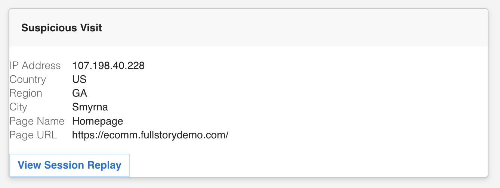

# Teams Adaptive Cards

Creating more feature-rich messages is possible with Teams [Adaptive Cards](https://learn.microsoft.com/en-us/microsoftteams/platform/task-modules-and-cards/what-are-cards#adaptive-cards-and-incoming-webhooks). Use the final [JSON Mapping](#final-json-mapping) found at the end of each example or follow the steps to create your own Adaptive Card message using the [Message Card Playground](https://amdesigner.azurewebsites.net/).



## Suspicious Visit

### Adaptive Card Template

Design your card in the Message Card Playground using string literals for field references, then convert to Advanced JSON Mapping syntax. The following template represents the Suspicious Visit card design:

```json
{
  "$schema": "http://adaptivecards.io/schemas/adaptive-card.json",
  "type": "AdaptiveCard",
  "version": "1.2",
  "body": [
    {
      "type": "Container",
      "style": "emphasis",
      "items": [
        {
          "type": "TextBlock",
          "text": "['var', 'stream.name']",
          "wrap": true
        }
      ],
      "padding": "Default"
    },
    {
      "type": "FactSet",
      "facts": [
        {
          "title": "IP Address",
          "value": "['var', 'event.0.ip_address']"
        },
        { "title": "Country", "value": "['var', 'event.0.country']" },
        { "title": "Region", "value": "['var', 'event.0.region']" },
        { "title": "City", "value": "['var', 'event.0.city']" },
        { "title": "Page Name", "value": "['var', 'event.0.page_name']" },
        { "title": "Page URL", "value": "['var', 'event.0.url']" }
      ]
    }
  ],
  "actions": [
    {
      "type": "Action.OpenUrl",
      "title": "View Session Replay",
      "url": "['var', 'event.0.app_url_event']"
    }
  ]
}
```

Make three adjustments to convert the template into valid Advanced JSON Mapping syntax.

### Replace `var` strings with JSON arrays

The Message Card Playground only accepts plain strings, so field references are written as string literals using single quotes. In Advanced JSON Mapping they must be actual JSON arrays using double quotes. Remove the surrounding quotes and switch single quotes to double quotes.

Before:

```json
"text": "['var', 'stream.name']"
```

After:

```json
"text": ["var", "stream.name"]
```

### Add "list" as the first element of every array

Advanced JSON Mapping uses a Lisp-style syntax where the first element of a JSON array is treated as a function name. To produce a literal array (not a function call), insert `"list"` as the first item. Apply this to the top-level `attachments` array, the `body` array, the `facts` array inside FactSet blocks, and the `actions` array.

Before:

```json
"facts": [
  { "title": "IP Address", "value": "..." },
  ...
]
```

After:

```json
"facts": [
  "list",
  { "title": "IP Address", "value": "..." },
  ...
]
```

### Final JSON Mapping

```json
{
  "$schema": "http://adaptivecards.io/schemas/adaptive-card.json",
  "type": "AdaptiveCard",
  "version": "1.2",
  "body": [
    "list",
    {
      "type": "Container",
      "style": "emphasis",
      "items": [
        {
          "type": "TextBlock",
          "text": ["var", "stream.name"],
          "wrap": true
        }
      ],
      "padding": "Default"
    },
    {
      "type": "FactSet",
      "facts": [
        "list",
        { "title": "IP Address", "value": ["var", "event.0.ip_address"] },
        { "title": "Country", "value": ["var", "event.0.country"] },
        { "title": "Region", "value": ["var", "event.0.region"] },
        { "title": "City", "value": ["var", "event.0.city"] },
        { "title": "Page Name", "value": ["var", "event.0.page_name"] },
        { "title": "Page URL", "value": ["var", "event.0.url"] }
      ]
    }
  ],
  "actions": [
    "list",
    {
      "type": "Action.OpenUrl",
      "title": "View Session Replay",
      "url": ["var", "event.0.app_url_event"]
    }
  ]
}
```

---

## Keyword Monitoring

### Adaptive Card Template

```json
{
  "$schema": "http://adaptivecards.io/schemas/adaptive-card.json",
  "type": "AdaptiveCard",
  "version": "1.2",
  "body": [
    {
      "type": "Container",
      "style": "emphasis",
      "items": [
        {
          "type": "TextBlock",
          "text": "['var', 'stream.name']",
          "wrap": true
        }
      ],
      "padding": "Default"
    },
    {
      "type": "FactSet",
      "facts": [
        { "title": "Keyword(s)", "value": "['var', 'event.0.target_text']" },
        { "title": "Page Name", "value": "['var', 'event.0.page_name']" },
        { "title": "Page URL", "value": "['var', 'event.0.url']" }
      ]
    }
  ],
  "actions": [
    {
      "type": "Action.OpenUrl",
      "title": "View Session Replay",
      "url": "['var', 'event.0.app_url_event']"
    }
  ]
}
```

### Final JSON Mapping

```json
{
  "$schema": "http://adaptivecards.io/schemas/adaptive-card.json",
  "type": "AdaptiveCard",
  "version": "1.2",
  "body": [
    "list",
    {
      "type": "Container",
      "style": "emphasis",
      "items": [
        {
          "type": "TextBlock",
          "text": ["var", "stream.name"],
          "wrap": true
        }
      ],
      "padding": "Default"
    },
    {
      "type": "FactSet",
      "facts": [
        "list",
        {
          "title": "Keyword(s)",
          "value": ["var", "event.0.target_text"]
        },
        { "title": "Page Name", "value": ["var", "event.0.page_name"] },
        { "title": "Page URL", "value": ["var", "event.0.url"] }
      ]
    }
  ],
  "actions": [
    "list",
    {
      "type": "Action.OpenUrl",
      "title": "View Session Replay",
      "url": ["var", "event.0.app_url_event"]
    }
  ]
}
```

---

## VIP Visit

### Adaptive Card Template

```json
{
  "$schema": "http://adaptivecards.io/schemas/adaptive-card.json",
  "type": "AdaptiveCard",
  "version": "1.2",
  "body": [
    {
      "type": "Container",
      "style": "emphasis",
      "items": [
        {
          "type": "TextBlock",
          "text": "['var', 'stream.name']",
          "wrap": true
        }
      ],
      "padding": "Default"
    },
    {
      "type": "FactSet",
      "facts": [
        { "title": "User", "value": "['var', 'event.0.user_email']" },
        { "title": "Page Name", "value": "['var', 'event.0.page_name']" },
        { "title": "Page URL", "value": "['var', 'event.0.url']" }
      ]
    }
  ],
  "actions": [
    {
      "type": "Action.OpenUrl",
      "title": "View Session Replay",
      "url": "['var', 'event.0.app_url_event']"
    }
  ]
}
```

### Final JSON Mapping

```json
{
  "$schema": "http://adaptivecards.io/schemas/adaptive-card.json",
  "type": "AdaptiveCard",
  "version": "1.2",
  "body": [
    "list",
    {
      "type": "Container",
      "style": "emphasis",
      "items": [
        {
          "type": "TextBlock",
          "text": ["var", "stream.name"],
          "wrap": true
        }
      ],
      "padding": "Default"
    },
    {
      "type": "FactSet",
      "facts": [
        "list",
        { "title": "User", "value": ["var", "event.0.user_email"] },
        { "title": "Page Name", "value": ["var", "event.0.page_name"] },
        { "title": "Page URL", "value": ["var", "event.0.url"] }
      ]
    }
  ],
  "actions": [
    "list",
    {
      "type": "Action.OpenUrl",
      "title": "View Session Replay",
      "url": ["var", "event.0.app_url_event"]
    }
  ]
}
```

If you're using a Custom User Property, replace `user_email` with the property itself (e.g. `loyalty_tier`).
